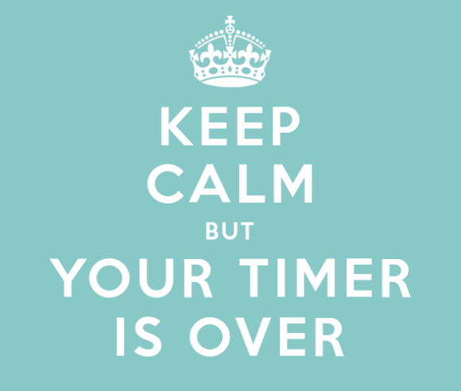

# LiLimit

   

## _This Chrome extension will help you control your time_

### Control time spent on any website and manage daily visits.

## Installation and download

### Google web store

- [Search for LiLimit in google chrome store](https://chromewebstore.google.com/search/lilimit).
- Install it.

### Manualy Dowload

- Download the source code from [Github](https://github.com/jonis100/LiLimit) and extract it.
- Go to chrome://extensions/ and check the box for Developer mode in the top right.
- Go to the chrome://extensions/ page and click the Load unpacked extension button and select the unzipped folder for your extension to install it.

## Features

- **Daily Visit Limits**: Set maximum visits per day (resets daily at midnight)
- **Time Limits**: Limit time per visit (tracked while tab is open, even if inactive)
- **Flexible Configuration**: Set time limits only, visit limits only, or both
- **Manage Limits**: Add, update, or delete limits for any website
- **View Dashboard**: See all configured limits at a glance

## Usage

1. To use LiLimit, press on LiLimit icon on extension bar:
   - Insert URL of the website for limitation.
   - Insert desire time per each visit.
   - Insert desire visits per day.
   - Click Set Limits.
2. To update limitations for website repeat on 1. section.
3. To remove limitation for website:
   - Insert URL of the website for delete.
   - Click Delete Limits.
   - ALL limits for this website will be removed.
4. To show the lists of limited websites:
   - Click Show Limits.

## Exceeded

When someone exceeded the limits, the tab redirect to here:

# Visits per day exceeded

# Time exceeded

## License

MIT

**Free Software, Hell Yeah!**
